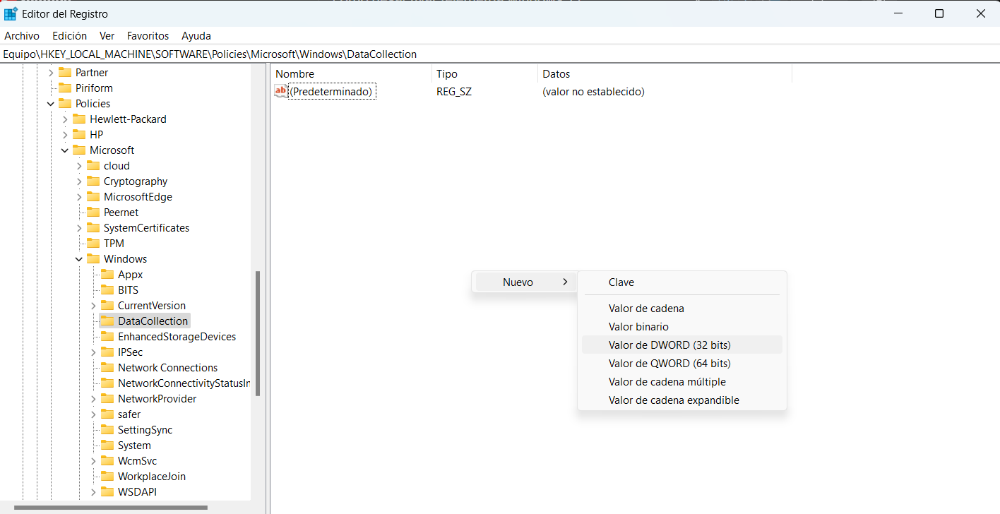

# Desactivar telemetría en windows

Estos son los pasos para desactivar la telemetría y hacer un poco más óptimo el pc

1. Ir a aplicación Servicios con comando: `services.msc`
2. buscar servicio de experiencia de usuario y telemetría asociadas

3. colocar en tipo de inicio deshabilitado y detener el servicio
4. buscar Servicio de enrutamiento de mensajes de inserción del protocolo de aplicación WAP de administración de dispositivos

5. ir a regedit a la ruta Equipo\HKEY_LOCAL_MACHINE\SOFTWARE\Policies\Microsoft\Windows\DataCollection
6. click derecho crear un nuevo QWORD y asignarle el nombre de “Allow Telemetry”

7. da doble click sobre el valor y confirma que sea 0
8. windows + r comando: `gpedit.msc` en windows home no está este paqueta así que toca instalarlo se puede instalar con este .bat

```bash
@echo off 
pushd "%~dp0" 

dir /b %SystemRoot%\servicing\Packages\Microsoft-Windows-GroupPolicy-ClientExtensions-Package~3*.mum >List.txt 
dir /b %SystemRoot%\servicing\Packages\Microsoft-Windows-GroupPolicy-ClientTools-Package~3*.mum >>List.txt 

for /f %%i in ('findstr /i . List.txt 2^>nul') do dism /online /norestart /add-package:"%SystemRoot%\servicing\Packages\%%i" 
pause
 ```
